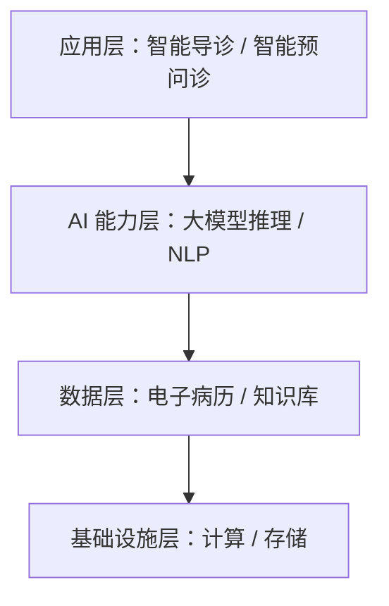

# 范例 · 好的架构小节（正例）

一个合格的"总体架构说明"小节 + 图长这样（对应 `sections/architecture/overall-architecture.md`）。

## 示例（独立模式，用 mermaid）

```markdown
### 总体架构说明

系统采用分层架构，自下而上分为四层：基础设施层提供计算与存储；
数据层沉淀病历与知识库；AI 能力层提供大模型推理与 NLP 意图识别；
应用层承载智能导诊与智能预问诊两大能力。各层职责清晰、逐层支撑。

（据《系统架构说明》）
```



## 为什么这是好的

- 分层与各层组件**都来自素材**，没有凭空加"区块链""联邦学习"等素材没提的模块。
- 文字说明与图**一一对应**（图上四层，文里也讲四层）。
- 段末标来源。
- mermaid 节点标签含中文冒号，**用英文双引号包裹**，不会解析报错。
- 独立模式用 mermaid，没有编造图片路径；若是满血模式，这里改用 genimage 门面彩图。
