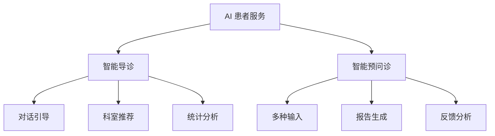

# 系统功能架构

用一张图 + 说明呈现系统功能的分层/分块组织——是"系统功能"详述章的架构预览。

## 何时用 / 不用

- 用：功能较多、需要先给全景的系统。
- 不用：功能极简的系统可并入总体架构。

## 缺失信息优先提问顺序

1. 功能分几大模块/域，各含哪些子功能
2. 模块间的层级/调用关系

## 结构骨架（逐行）

- 一段说明功能如何分层分块
- 一张功能架构图（模块树/分层）

## 写作要点

- 功能模块划分与"系统功能"详述章一致，别两处矛盾。
- 模块名用素材里的，不自造。

## 本节常见呈现变体

- 段落 + 一张 mermaid 功能架构图。

## 配图 / 结构图建议

- mermaid 用分层或树状表达功能模块（见 `methodology/images-and-figures.md`）：

## 正例 / 反例

- 正例：「系统功能分为智能导诊与智能预问诊两大模块，各含交互、统计分析、后台管理子功能。（据《产品说明》）」——模块与第三章"系统功能"逐一对应。
- 反例：架构图列了"智能随访"模块，但功能章根本没写——图文不符。
