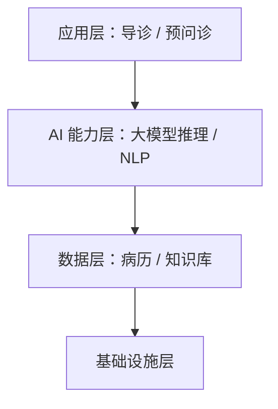

# 总体架构说明 + 系统总体架构图

架构区开篇，讲系统整体怎么搭 + 一张门面级总体架构图。是方案的"技术门面"。

## 何时用 / 不用

- 用：建设/技术方案必备。
- 不用：纯产品价值方案可轻量化或省略。

## 缺失信息优先提问顺序

1. 系统分几层/几大部分（素材里的架构描述）
2. 各层包含哪些组件、层间关系

## 结构骨架（逐行）

- 一段总体架构说明：系统采用什么架构（如分层架构），自下而上/自内而外由哪几层组成
- 各层简述：每层职责 + 主要组件
- 一张**总体架构图**（门面级）

## 写作要点

- 组件、分层**必须来自素材事实**（见 `methodology/grounding-and-citation.md`），绝不为画面丰满编造模块。
- 说明与图要一致，别图上有的文里没讲。

## 本节常见呈现变体

- 段落说明 + 一张门面架构图。

## 配图 / 结构图建议（重点）

这是**门面级架构图**，按模式分（见 `methodology/images-and-figures.md`）：
- **满血模式**：用 genimage 出彩图（专业美工质感）。
- **独立模式**：**不执行生图**——用 mermaid 分层图，或写 genimage 描述块 + 占位，**绝不编造图片路径**。

mermaid 分层示例（组件须来自素材）：

## 正例 / 反例

- 正例：架构图里每个组件都能在素材里找到对应描述，文字说明与图一一对应。
- 反例：为"显得高级"在图里加了"区块链""联邦学习"等素材根本没提的模块——编造，删。
