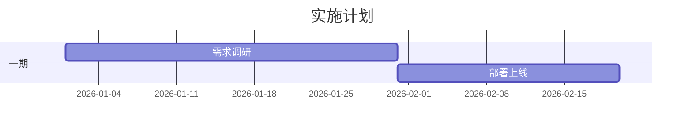

# 实施计划

讲项目怎么落地——分几期、各期做什么、时间节点、里程碑。常配甘特图。

## 何时用 / 不用

- 用：建设/投标/POC 方案，需要交代落地节奏时。
- 不用：纯产品能力介绍方案。

## 缺失信息优先提问顺序

1. 项目分几个阶段、各阶段任务
2. 各阶段时间/工期、关键里程碑

## 结构骨架（逐行）

- 一段实施策略总述（分期思路）
- 分阶段说明：阶段名 + 任务 + 交付物 + 工期（表格或甘特图）
- 关键里程碑

## 写作要点

- **排期、工期、里程碑日期是编造重灾区**——只写素材/用户给的，无据标 `⚠️ 资料缺失`，别自造时间表。
- 区分"实施计划"（项目排期）与"技术路线"（技术演进，在 `architecture/tech-roadmap.md`）。

## 本节常见呈现变体

- **表格 + 甘特图**（`methodology/tables.md`、`methodology/images-and-figures.md`）。

## 配图 / 结构图建议

- mermaid 甘特图（gantt）表达排期；节点/日期须有素材依据：

（若无真实排期，别画假甘特图，改为文字说明分期思路 + 标缺料）

## 正例 / 反例

- 正例：「一期完成需求调研与系统部署，二期试运行与用户培训（据《实施方案》）」——分期与工期来自素材，甘特图与表格一致。
- 反例：素材没排期，却编了一张"一期2月、二期3月"的精确甘特图——编造。
