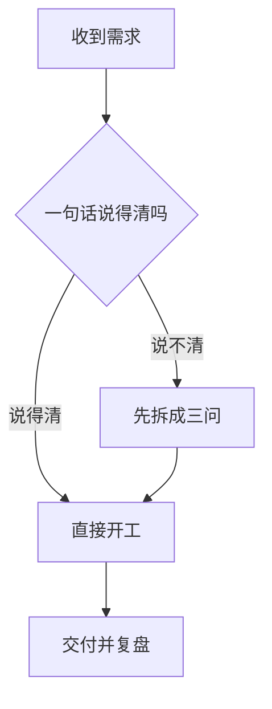
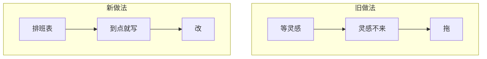

# 配图参考 · 写手在 Step 6 读

> 写手写到某一节，如果这一节该配图，就在动笔写这一节之前 `Read` 本文件，照下面的判据和格式留出图指令。
> **不新增角色。** 配图仍是写手的活，本文件只是写手的参考资料，不是岗位说明书——没有「职责 / 边界」，只有判据、格式、示例。
> 契约字段名（`image_plan` / `image_count` / `image_style`）定义见 `templates/spec_lock_reference.md` 的「## 配图」段，本文件不重复定义，只讲怎么用。

---

## 什么该配图、什么不该

**唯一判据：这张图能否比同等篇幅的文字更快说清一件事？不能就不配。**

配图是替读者省认知——省下他脑内脑补画面、或省下他在心里画流程图的力气。配图**不是**装饰、不是用来断开长文视觉疲劳的呼吸符号。凡是拿掉这张图、读者理解成本没有增加的，都不该配。

该配的三种场景：

- 一句话讲不清楚的**流程/关系/对比**（例如三步决策链、新旧做法对照）——用信息图。
- 需要读者**立刻进入某个场景的情绪**，文字铺陈要花一整段才能到达的氛围（例如「凌晨三点的便利店」）——用氛围图。
- 全篇的**封面**，承担点开前的第一眼判断。

不该配的三种场景：

- **纯为了断开长文而塞的风景图**——文章读起来喘不过气，该做的是拆段落、加小标题，不是插一张无关的图掩盖节奏问题。
- **与段落内容无关的情绪图**——图面上是海边落日，段落讲的是加班焦虑，图和文字对不上，读者会愣一下，这是负收益。
- **把已经说清的一句话再画一遍**——「他推开了门」配一张推门的图，文字已经把画面说清楚了，图没有信息增量，纯浪费一次生图额度。

---

## 两条腿：氛围图 vs 信息图

配图分两条腿走，判据是内容类型，不是个人喜好：

| 内容类型 | 走哪条腿 | 产出形式 |
|---|---|---|
| 一句话能说清的关系 / 流程 / 对比 | 信息图 | ```` ```mermaid ```` 围栏块 |
| 讲氛围、场景、情绪、封面 | 氛围图 | ```` ```genimage ```` 出图指令 |

**为什么信息图不用生图，一定要用 mermaid：**

生图模型（画图用的 AI 模型）画不好字。它是按像素生成图案的，不是按语义排版文字的——分辨率越高、笔画越复杂的汉字，它越容易画成偏旁部首拼错、笔画断裂、根本不存在的字。中文标注**必糊必错**，公众号读者会一眼看出「这图是 AI 画的」，砸的是可信度，是硬伤，不是小瑕疵。

`mermaid` 里的字是真文字（浏览器/渲染器把文字当文字画，不是当图案画）：**清晰、可改、可复制**。要改一个节点名字，改一个字就行；要调整流程顺序，挪一行代码就行。氛围图做不到这种精确控制——多试几次都未必能让它把字画对。

---

## 氛围图：出图指令怎么写

出图指令写在正文里，用 ```` ```genimage ```` 围栏块。写手在这一节该出现氛围图的位置，直接写下面这种块——它不是最终图片，是留给后续出图步骤读取执行的指令。

四条硬要求：

1. **构图描述要具体到「画面里有什么、什么光线、什么视角」**——不能只写「便利店，安静」，要写清楚谁在画面里（或没有人）、光源在哪、是俯视还是平视。描述越具体，出图结果越可控。
2. **风格取自契约的 `image_style`，不在指令里另起一套**——`image_style` 是策划和用户已经拍板的画法（色调、有无文字、线条还是写实），每张图都要落这个风格，不能这张写「低饱和暖色」那张写「高对比冷色」，风格必须全篇统一。
3. **不要求模型在图里写字**——理由见上一节，生图模型的字必糊必错，指令里要明确写「不要出现任何文字」这类限定，别指望它能画出可读的汉字。
4. **不要水印与无关装饰**——指令里不加「杂志封面感」「品牌 logo」这类会引入水印状元素的描述，保持画面干净。

两个完整示例（照抄格式，替换具体内容）：

```genimage
图说: 凌晨三点的便利店，是很多人一天里唯一的松弛
夜晚的便利店内景，暖黄色顶灯，落地玻璃窗外在下雨。
一个人背对镜头坐在窗边高脚凳上低头写字，只见背影与肩线。
平视视角，画面安静，色调偏暖。不要出现任何文字。
```

```genimage
图说: 把「等灵感」换成「排班表」
俯视视角的木质书桌一角，摊开的纸质周历上密密标着记号，
旁边一支笔和一杯凉掉的咖啡。自然光从左侧斜射进来。
低饱和暖色，不要出现可辨认的文字或数字。
```

**封面必须是全文第一张图。** 当 `image_plan` 是 `cover-only` 或 `inline` 时，封面图必须是全文第一个 `` 引用，写在正文最前面（标题之后、正文第一节之前）——不能先在正文中间放一张配图，把封面留到后面才补。

为什么这条是硬规则不是建议：导出脚本（`scripts/export.py` 的 `build_image_manifest`）生成插图清单时，**靠位置识别封面**——它把文档里第一个出现的图片引用直接标成「封面（在编辑器的封面位单独上传，不要插进正文）」，不看图说、不看内容，只看谁排第一。如果正文图排在封面前面，这张正文图会被错误标成「封面」，交付清单会告诉用户「这张图不要插进正文」——一张真正该出现在文章里的插图，就这样在导出环节被悄悄漏掉，作者也很难第一时间发现。所以封面的位置不是审美选择，是导出脚本的读取契约。

---

## 信息图：mermaid 怎么写

信息图走 ```` ```mermaid ```` 围栏块，是正文的一部分（不消耗 `image_count`、不受 `image_style` 约束）。写手直接把 mermaid 代码写进正文对应位置。

三条公众号限制，都是可执行的硬指标：

- **方向优先 `graph TD`（从上到下）。** 手机屏幕窄，横向排布的图（`graph LR`）会被压缩变形，节点和文字挤成一团、几乎看不清。除非内容本身就是严格的时间线（左右顺序有强含义），否则一律竖排。
- **节点数封顶，建议 ≤7。** 超过 7 个节点，公众号图片宽度有限，要么字挤成一团，要么要缩放到看不清。节点多说明这件事本身没拆清楚，该先在文字里拆成两张图或精简流程，而不是硬塞进一张图。
- **单节点文字尽量短，建议 ≤10 字。** 节点框的宽度有限，长文字会被挤压换行甚至溢出。想表达的意思超过 10 字，说明这应该是节点旁边的正文说明，而不是塞进节点框里。

两个可直接抄的示例：





---

## 图说怎么写

图说要有信息增量，**禁止**「如图所示」「下图展示了」这类零信息说明——这类话读者不看图说也知道，等于没写。好的图说要么补一句图里看不出来的判断，要么把图和上下文的关系点破。

图说不是可有可无的装饰文字，它同时承担三个身份：`` 里的 alt 文字（读屏器/图片加载失败时读者看到的内容）、公众号插图清单里的条目名（导出脚本按图说列清单，见上一节）、Word 导出里的题注。写不好图说，这三处都跟着受影响。

三组「差 → 好」对照：

- 差：「如图所示」 → 好：「把『等灵感』换成『排班表』」（点破图要传达的判断，不是复述图里有什么）
- 差：「便利店的夜晚」 → 好：「凌晨三点的便利店，是很多人一天里唯一的松弛」（补一句图里看不出来的情绪判断）
- 差：「下图展示了两种做法的对比」 → 好：「旧做法靠等，新做法靠排」（把对比的结论直接说出来，读者扫一眼图说就懂了大半）

---

## 张数与预算

`image_count` 是本篇配图的**上限**，封面也算在内一起数——不是「封面之外还能配 N 张」。生图是要花钱的（真实调用生图模型产生费用），`image_count` 是花钱前的第一道闸。

写这一节前，先数一下已经用掉几张（含封面），确认这一节配了图之后不会超过契约里的 `image_count`。

**超出上限时的做法：优先保留信息图，砍氛围图。** 理由很直接：`mermaid` 不花钱、也不占 `image_count` 的额度（见「信息图」一节），氛围图才是真金白银的开销。同样是配图需求，能用 mermaid 说清的，优先换成 mermaid；实在只能用氛围图表达的场景（情绪、氛围、封面），才占用有限的额度。张数吃紧时，先保留封面（承担第一眼判断，收益最高），再按「这张图去掉读者理解成本会不会明显上升」排序取舍其余氛围图。
